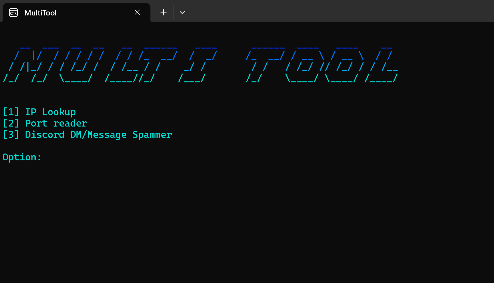

  <h1 align="center">🛠️ first_MultiTool 🛠️</h1>
  
Welcome to <b>first_MultiTool</b>, a versatile toolkit for network exploration and automation.

---

  
   
  <i>✨ Behold the interface in all its glory! ✨</i>

---

## Available Tools

### 🔍 IP Lookup

Retrieve location and network metadata for a specific IP address by querying `ip-api.com`.

- **Method:** JSON API query.
- **Data:** Geo-location, ISP, and ASN information.

### 🔓 Port Scanner

Identify open ports on a target IP by creating a socket connection across a custom port range.

- **Security Tip:** Use a VPN to remain anonymous; otherwise, your local IP will be logged by the target.

### 🛡️ Discord Token Checker

Validate your list of Discord tokens to ensure they are active and not disabled.

- **Automation:** Mass-check tokens.
- **Feedback:** Real-time status reporting (Valid/Invalid/Locked).

### 🧨 Discord Account Nuker

A powerful automation utility for account management.

- **Functions:** Mass-leave servers, delete friends, and toggle account settings.
- **Note:** Requires a valid User Token to execute commands.

### 💬 Discord DM/Message Spammer

Automate messaging using multiple account tokens stored in `token.txt`.

- **Customizable:** Set message content and repetition count.
- **Targeting:** Requires a **Channel ID** and optional **Server ID**.
- **Upcoming:** Proxy list integration for rate-limit bypassing. 🛡️

### 🪝 Webhook Message Spammer

Send high-speed automated messages to any Discord channel using a Webhook URL.

- **Efficiency:** Does not require account tokens.
- **Speed:** Capable of rapid-fire messaging until rate-limited.

---

## 🚀 Getting Started

1.  **Installation**: Ensure you have Python 3.x installed.
2.  **Setup**: Download and unzip the folder and open main.py
3.  **Launch**: Follow the interactive menu prompts.

---

## 📜 Disclaimer

This project is for **educational purposes only**. The developer is not responsible for any misuse or legal consequences. Use responsibly and only on systems you own or have permission to test. ⚖️
